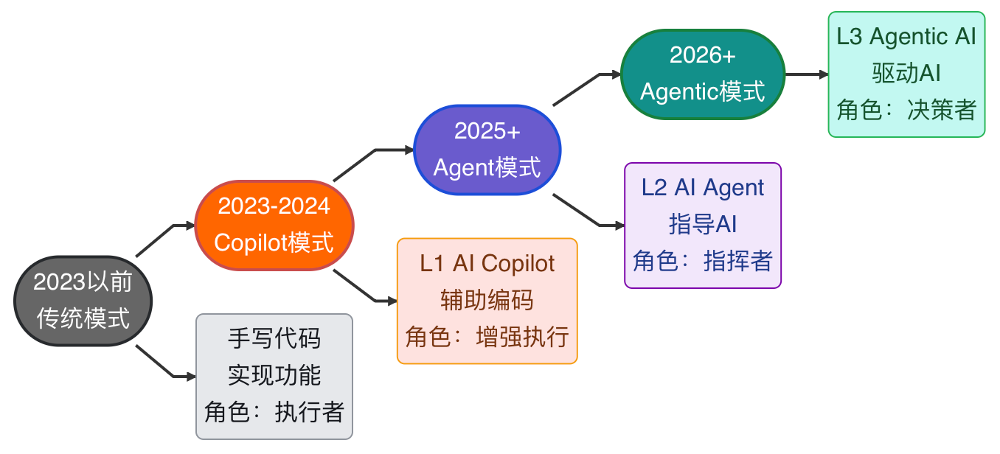
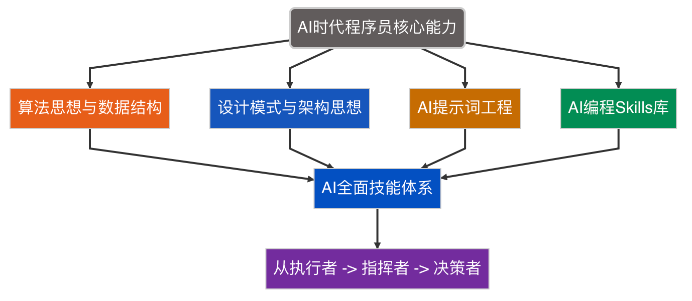

  <h1 style="color:#1f883d; font-weight:900; font-size:2.5em; text-shadow: 0 0 8px rgba(211, 231, 211, 0.5);">MicroWind | AI 编程核心知识库</h1>
  

      <a href="https://github.com/microwind/algorithms" style="color:#FF6600;">算法思想</a> ·
      <a href="https://github.com/microwind/design-patterns" style="color:#FF6600;">设计模式</a> ·
      <a href="https://github.com/microwind/ai-prompt" style="color:#FF6600;">Prompts</a> ·
      <a href="https://github.com/microwind/ai-skills" style="color:#FF6600;">Skills</a>
  

---

## AI 编程时代发展历程

> AI能替代编码，无法替代思考；提升思想与认知，是驾驭 AI 的核心竞争力。 

## AI 编程核心能力矩阵

> 表层的 API、开发框架日新月异，而算法思想、设计模式、底层逻辑历久弥新。

---

## AI 编程四大核心仓库

### 1.  [algorithms](https://github.com/microwind/algorithms)| 算法思想与数据结构

> 理解算法与数据结构，指导AI做出合理决策。

- 覆盖数值计算、字符查找、树遍历、排序、动态规划等
- C/Java/Python/JS/Go/TypeScript/Rust 多种语言实现
- 注释详尽、例子递进，兼顾算法原理与编程语言特性

👉 [github.com/microwind/algorithms](https://github.com/microwind/algorithms)

### 2.   [design-patterns](https://github.com/microwind/design-patterns) | 设计模式与架构思想

> 理解设计模式与架构思想，让AI写出有灵魂的代码

- 经典设计模式 + 编程范式详解 ，结合实际场景
- 支持 C/Java/JS/Python/Go 多语言实现  
- 持续完善，打造 AI 时代架构思维库

👉 [github.com/microwind/design-patterns](https://github.com/microwind/design-patterns)

### 3.  [ai-prompt](https://github.com/microwind/ai-prompt) | 程序员 Prompt Engineering 知识库

> 14 大场景提示词，与AI交流称心如意

- 覆盖软件开发全流程的 AI 协作指南  
- 适配 Claude Code、Codex、OpenClaw
- 提示词实践，提高工作效率

👉  [github.com/microwind/ai-prompt](https://github.com/microwind/ai-prompt)

### 4.  [ai-skills](https://github.com/microwind/ai-skills) | AI 编程 Skills 知识库大全

> 100 + 结构化技能库，用AI搭建工程化系统

- 为程序员量身打造的 AI Skills 体系  
- 涵盖流行框架、工具、实战技巧  
- AI 精准匹配技能需求，高效辅助开发

👉 [github.com/microwind/ai-skills](https://github.com/microwind/ai-skills)

---

## 核心愿景

> **AI时代，做AI驱动者，不做代码搬运工**

**本仓库旨在帮助大学生和程序员朋友：**

1. 掌握核心思想，筑牢底层认知，驾驭 AI 而非被 AI 替代
2. 掌握高效协作 AI 的方法，让 AI 成为核心生产力
3. 从 **代码执行者** 到 **AI指挥者** 再到 **AI决策者**

---

## 相关链接

- [AI编程时代，为什么35岁以上程序员会更吃香？](https://github.com/microwind/algorithms/blob/main/start-here/Why-Programmers-35-Plus-Are-Thriving-in-AI-Era.md)
- [AI时代，人人都是AI Agent工程师](https://github.com/microwind/algorithms/blob/main/start-here/AI-Era-Programmers-as-Agent-Engineers.md)
- [AI时代，人人都是需求描述工程师](https://github.com/microwind/algorithms/blob/main/start-here/AI-Era-Programmers-as-Requirements-Engineers.md)
- [AI时代，人人都是系统设计工程师](https://github.com/microwind/algorithms/blob/main/start-here/AI-Era-Programmers-as-System-Design-Engineers.md)
- [AI时代，人人都是算法思想工程师](https://github.com/microwind/algorithms/blob/main/start-here/AI-Era-Programmers-as-Algorithmic-Thinkers.md)

---

## 🌟 欢迎共建

`站点`： [https://microwind.github.io](https://microwind.github.io) 
`仓库`： [https://github.com/microwind](https://github.com/microwind)

如果您对本项目感兴趣请加我，欢迎一起共建！

 If you are interested in this project, please add me. I welcome you to build it together!

我是Jarry 李春平, 20年经验的互联网工程师。

- 📧 mail: `jarryli@gmail.com` or `lichunping@buaa.edu.cn`
- 💬 wechat: `springbuild`
- 🌟 如果这个项目对你有帮助，请给个 Star 支持一下！
